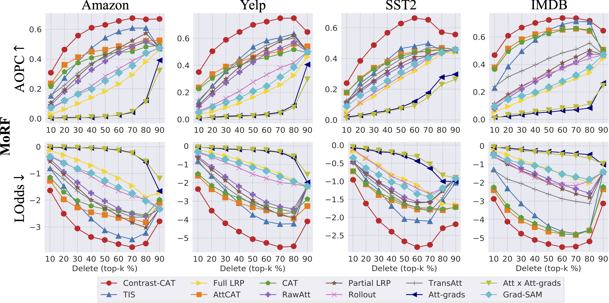

# Contrast-CAT: Contrasting Activations for Enhanced Interpretability in Transformer-based Text Classifiers, UAI'25
**Sungmin Han, Jeonghyun Lee, Sangkyun Lee (Corresponding author)**  

AIRLAB, School of Cybersecurity, Korea University


### 📄 Abstract

Transformers have profoundly influenced AI research, but explaining their decisions remains challenging – even for relatively simpler tasks such as classification – which hinders trust and safe deployment in real-world applications. Although activation-based attribution methods effectively explain transformer-based text classification models, our findings reveal that these methods can be undermined by class-irrelevant features within activations, leading to less reliable interpretations.
To address this limitation, we propose ContrastCAT, a novel activation contrast-based attribution method that refines token-level attributions by filtering out class-irrelevant features. By contrasting the activations of an input sequence with reference activations, Contrast-CAT generates clearer and more faithful attribution maps. 
Experimental results across various datasets and models confirm that Contrast-CAT consistently outperforms stateof-the-art methods. Notably, under the MoRF setting, it achieves average improvements of ×1.30 in AOPC and ×2.25 in LOdds over the most competing methods, demonstrating its effectiveness in enhancing interpretability for transformer-based text classification.

Keywords: Transformer, Interpretability, XAI, Attention, Contrast-based

You can read the full paper at  
👉 [Official Paper on OpenReview (UAI 2025)](https://openreview.net/forum?id=vaQMMxhCqy)

---

## ⚙️ Environment

  * Python v3.7.4
  * PyTorch v1.9.1
  * Huggingface-hub v0.14.1
  * datasets v2.13.2

### Model

We implemented Contrast-CAT on top of the **BERT-base** architecture (12 encoder layers, 12 attention heads) using the Hugging Face Transformers library.
While our method is model-agnostic and readily applicable to other transformer variants (e.g., DistilBERT, Llama 2), all primary experiments were conducted using **BERT-base** to ensure consistent comparison with prior work.  
Additional results using other transformer models are provided in the supplementary material (available in the arXiv version of the paper).

### Datasets

We used five publicly available NLP datasets for text classification tasks:

- **Amazon Polarity** : _Zhang et al._ [Character-level Convolutional Networks for Text Classification](https://papers.nips.cc/paper_files/paper/2015/file/250cf8b51c773f3f8dc8b4be867a9a02-Paper.pdf). NeurIPS, 2015.

- **Yelp Polarity** : _Zhang et al._ [Character-level Convolutional Networks for Text Classification](https://papers.nips.cc/paper_files/paper/2015/file/250cf8b51c773f3f8dc8b4be867a9a02-Paper.pdf). NeurIPS, 2015.

- **SST-2** : _Socher et al._ [Recursive Deep Models for Semantic Compositionality Over a Sentiment Treebank](https://aclanthology.org/D13-1170). EMNLP, 2013.

- **IMDB Reviews** : _Maas et al._ [Learning Word Vectors for Sentiment Analysis](https://aclanthology.org/P11-1015). ACL-HLT, 2011.

- **AG News** : _Del Corso et al._ [Ranking a Stream of News](https://dl.acm.org/doi/10.1145/1060745.1060764). WWW, 2005.

---

## 📈 Main Results

We evaluated Contrast-CAT under both **MoRF** (Most Relevant First) and **LeRF** (Least Relevant First) settings using AOPC and LOdds metrics. The results below summarize our method's performance compared to prior attribution methods.

| Dataset | Metric | Best Baseline | **Contrast-CAT** |
|---------|--------|----------------|------------------|
| Amazon  | AOPC ↑ | 0.560 (TIS)    | **0.703**        |
|         | LOdds ↓| 0.241 (TIS)    | **0.117**        |
| Yelp    | AOPC ↑ | 0.494 (TIS)    | **0.687**        |
|         | LOdds ↓| 0.346 (AttCAT) | **0.131**        |
| SST-2   | AOPC ↑ | 0.463 (TIS)    | **0.654**        |
|         | LOdds ↓| 0.367 (TIS)    | **0.157**        |
| IMDB    | AOPC ↑ | 0.644 (AttCAT) | **0.738**        |
|         | LOdds ↓| 0.198 (AttCAT) | **0.101**        |
| AG News    | AOPC ↑ | 0.354 (TIS) | **0.434**        |
|         | LOdds ↓| 0.473 (TIS) | **0.363**        |

> **↑ Higher is better**, **↓ Lower is better**

Contrast-CAT outperforms all baselines across all datasets in both AOPC and LOdds, under the MoRF setting. For full tables and LeRF results, please refer to the paper or the [supplementary material](link-to-arxiv).

<p align="center">
  
  <br/>
  <em>Figure: MoRF(Most Relevant First)-based AOPC and LOdds comparison. Higher AOPC and lower LOdds are better.</em>
</p>

### 🌀 On-the-Fly Contrast-CAT

Contrast-CAT is designed to work efficiently with a pre-built reference library, which significantly reduces computational cost during attribution generation.
We also implemented an on-the-fly version of Contrast-CAT that dynamically selects references at runtime via constrained random sampling.

**Table: Attribution quality and runtime comparison between the default Contrast-CAT and the on-the-fly version, evaluated on the SST-2 dataset.**

| Variant                      | AOPC ↑        | LOdds ↓       | Runtime (sec/sample) ↓ |
| ---------------------------- | ------------- | ------------- | ---------------------- |
| Reference Library (default)  | **0.654**     | **0.157**     | **2.13**               |
| On-the-Fly (random sampling) | 0.647 ± 0.009 | 0.159 ± 0.012 | 4.78                   |

📌 The on-the-fly version remains competitive in both attribution quality and runtime, outperforming other attribution methods.

---

## 🚀 Running Contrast-CAT

Before running Contrast-CAT, you must build the class-wise activation reference libraries for each dataset.

```
python build_reference_library.py --dataset_name [dataset_name]
```

This script saves reference activation libraries to ./ref_lib/{dataset}.pkl.
These libraries are required to compute contrastive attribution maps.

To run Contrast-CAT on a dataset (e.g., SST-2), use:

```
python get_attribute.py --method [attribution_method] --dataset_name [dataset_name] --reference_library_path [path_to_reference_library]
```

Optional arguments:

--attribution_method: can be Contrast-CAT, AttCAT, CAT, LRP, RawAtt, Rollout, Grad-SAM.


## 🔗 Related Work

**Contrast-CAT** is motivated by our earlier work on CNNs:

- **Paper**: Sangkyun Lee and Sungmin Han,  
  _“[Libra-CAM: An Activation-Based Attribution Based on the Linear Approximation of Deep Neural Nets and Threshold Calibration](https://www.ijcai.org/proceedings/2022/442)”_, IJCAI 2022


## 📬 Contact

For questions or collaboration inquiries — including building customized reference libraries, adapting Contrast-CAT to new domains, or integrating it with your own models — please refer to the contact information provided in the paper.

> 🔄 If you're interested in the **on-the-fly version** of Contrast-CAT (which does not require pre-built reference libraries), feel free to **reach out via the email listed in the paper**.


## Citation

If you found this work or code useful, please cite us:

```
@inproceedings{hancontrast,
  title={Contrast-CAT: Contrasting Activations for Enhanced Interpretability in Transformer-based Text Classifiers},
  author={Han, Sungmin and Lee, Jeonghyun and Lee, Sangkyun},
  booktitle={The 41st Conference on Uncertainty in Artificial Intelligence}
}
```
